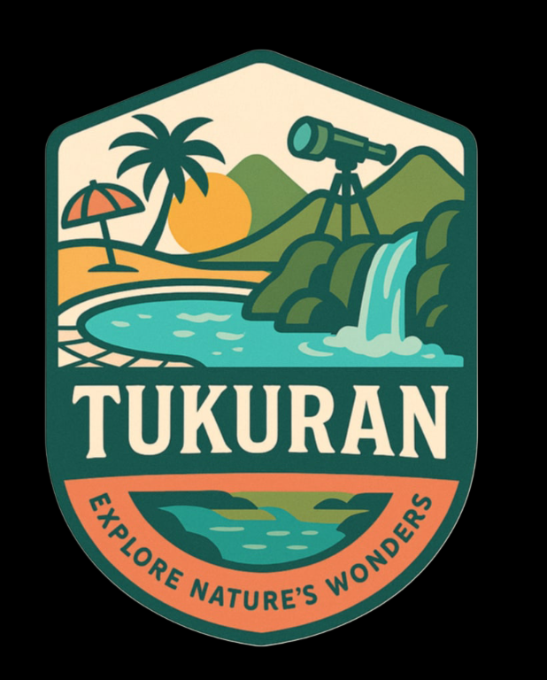
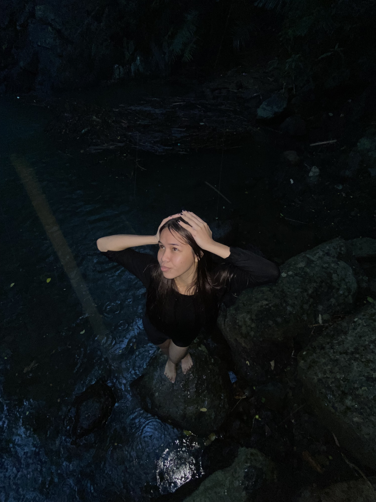

<html lang="en">
<head>
  <meta charset="UTF-8" />
  <meta name="viewport" content="width=device-width, initial-scale=1.0" />
  <title>TTS</title>
  <link rel="stylesheet" href="style.css" />
</head>
<body>
  <header class="header">
      <nav class="nav-container">
                      <a href="#backtomainpage" class="nav-link">Back to main page</a>
          <a href="#home" class="logo">
              
              Tukuran Tourist Spots
            </a>
          <ul class="nav-menu">
            <li class="nav-item">
                <a href="#home" class="nav-link">Home</a>
            </li>
            <li class="nav-item">
                <a href="#destination" class="nav-link">Facilities</a>
            </li>
                <li class="nav-item">
                    <a href="#gallery" class="nav-link">Gallery</a>
                </li>
                <li class="nav-item">
                    <a href="#developers" class="nav-link">Developers</a>
                </li>
            </ul>
        </nav>
    </header>

    <main class="main-content">
        
        <section id="home" class="hero">
            

                
                

 
            

            

                <h1>RBA Beach</h1>
                

                    
                

            

        </section>
        <section id="destination" class="featured-destinations">
            <h2 class="section-title">FACILITIES</h2>
            
            

                

                    

                        

                    

                

                

                    <h3>Cottages </h3>
                    
The cottages where you can put all your things, rest, and party.

                    <li>₱300.00 Cottage</li>
                

            

        
                        

                

                    

                        

 
                    

                

                

                    <h3>karaoke Area</h3>
                    
Show your talent here as a fantastic singer for 5 pesos you can enjoy two songs. 

                

            

                        

                

                    

                        

                    

                

                

                    <h3>Comfort Room</h3>
                    
Find your comfort here.

                

            

                        

                

                    

                        

                    

                

                

                    <h3>Store</h3>
                    
Forgot to purchase your foods? No problem.

                

            

            
        <section id="gallery" class="featured-destinations">
            <h2 class="section-title">Gallery</h2>

        

             
             
             
            
            
            
            
            
        

    </section>

        

    &times;
    <button class="modal-nav" id="prevBtn">&#10094;</button>
    
    <button class="modal-nav" id="nextBtn">&#10095;</button>
        

 

        <section id="developers" class="developers">
            <h2 class="section-title">Developers</h2>
            

                

                    

                        
                    

                    
Jerry A. Bulfa

                    

                    
Photographer/videographer

                

                

                    

                        
                    

                    
Crismie V. Jumamoy
 
                    

                    
Web developer
 
            

        </section>
  
    <footer class="footer">
        

            

                <h4>Tukuran Tourist Spots</h4>
                <ul class="footer-links">
                    <li><a href="#home">Home</a></li>
                    <li><a href="#destination">Facilities</a></li>
                    <li><a href="#gallery">Gallery</a></li>
                    <li><a href="#developers">Developers</a></li>
                </ul>
            

  

    <h4>Follow Us</h4>
        

            <a href="https://www.facebook.com/share/16cK27pfbX/" class="social-btn facebook">Facebook</a>
            <a href="#" class="social-btn twitter">Twitter</a> 
            <a href="https://www.instagram.com/itscrsmiemadear?igsh=emkyajZua3A2NnZ4" class="social-btn instagram">Instagram</a>
        

  

    

        

            
&copy; 2025 Tukuran Tourist Spots. All rights reserved. Discover your outing.

        

    </footer>
  
</body>
</html>
